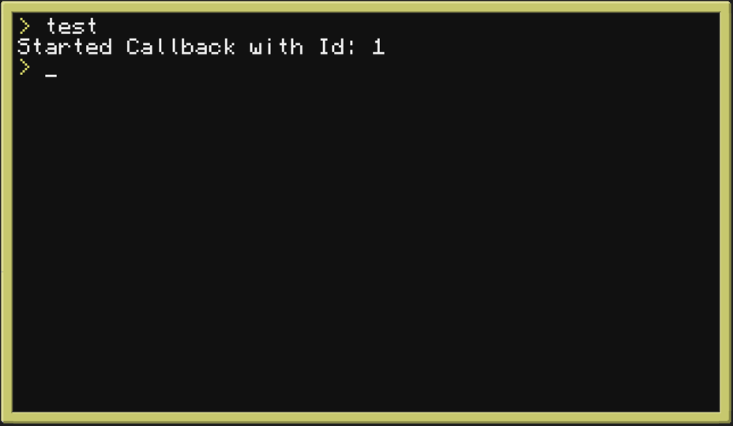

# EventCallStack-lib

This EventCallStack simulates EventHandlers similar to those of C#

## Example

```lua
--- Require
---@class EventCallStack
local EventCallStack = require("eventCallStack")

--- Init Event, do not forget that
local testEvent = EventCallStack('Test')

--- Add as many callbacks for the Event as required
local callbackID = testEvent:AddCallback(function(parameter)
    print(parameter)
end)

--- Invoke Event
testEvent:invoke('Started Callback with Id: ' .. callbackID)
```


